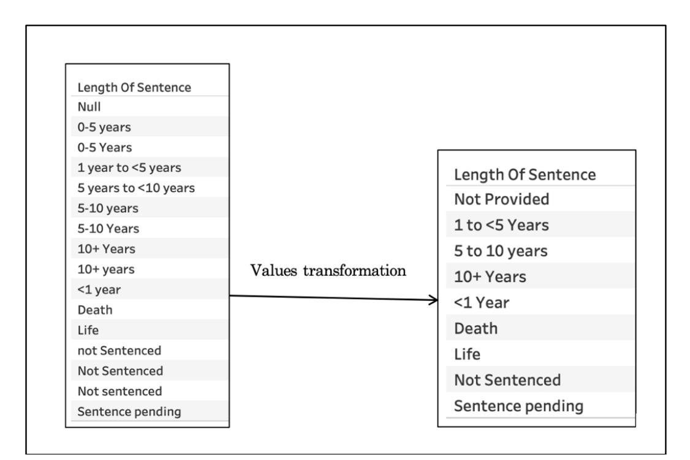
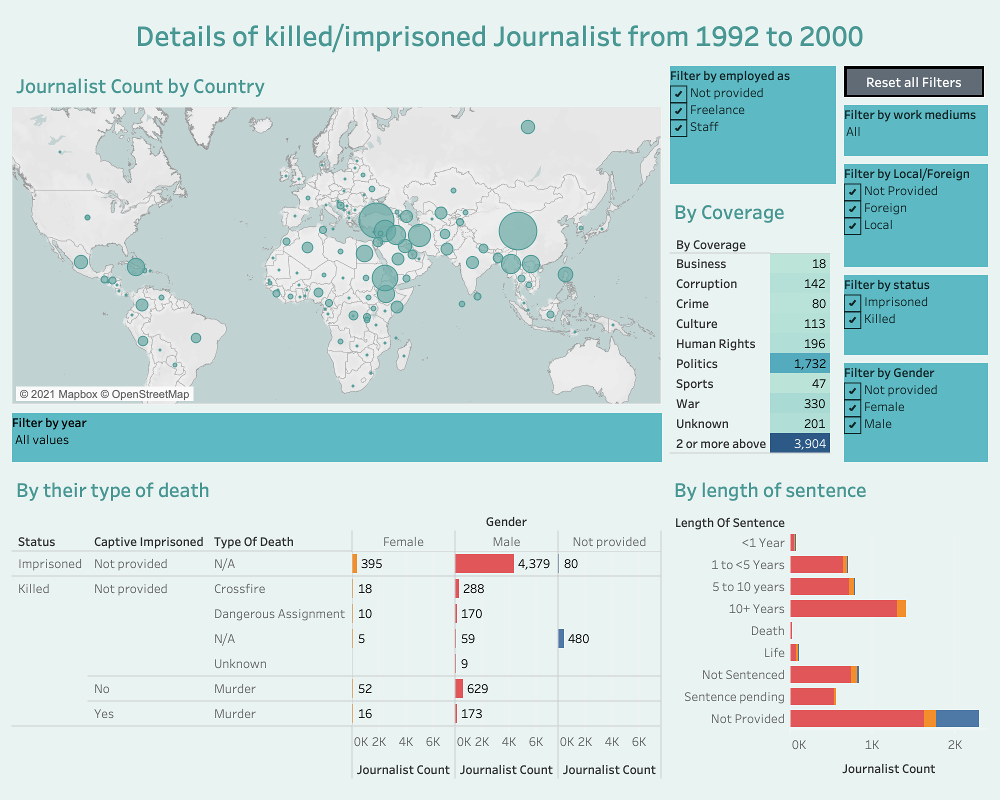
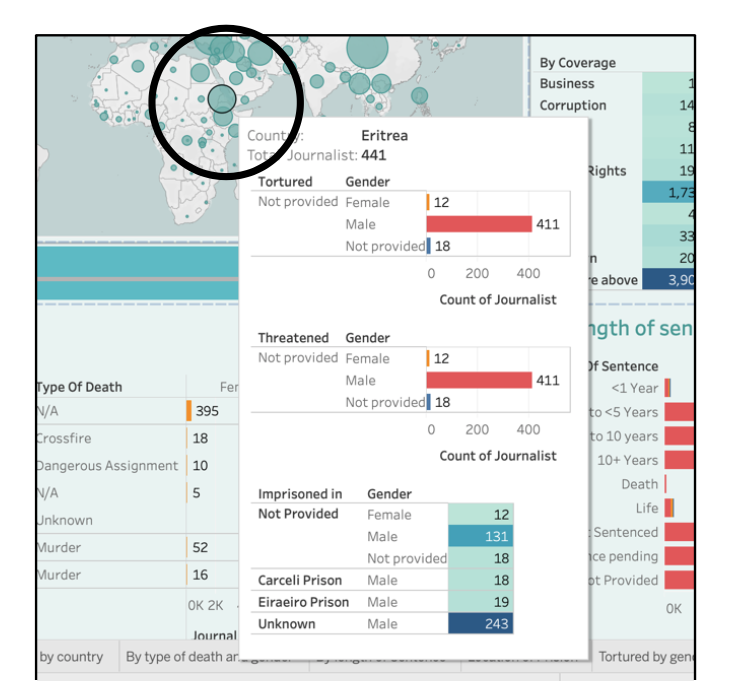
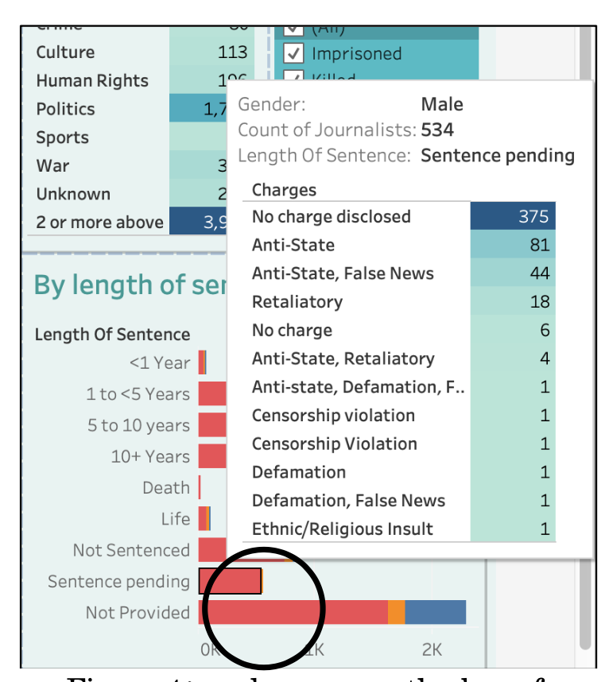
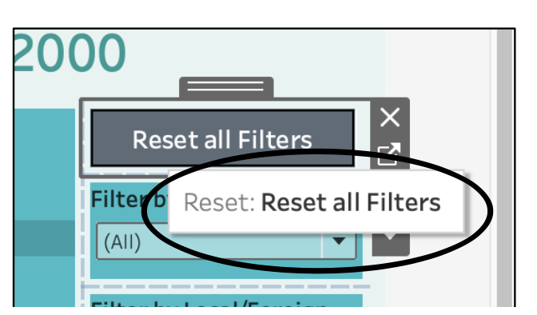
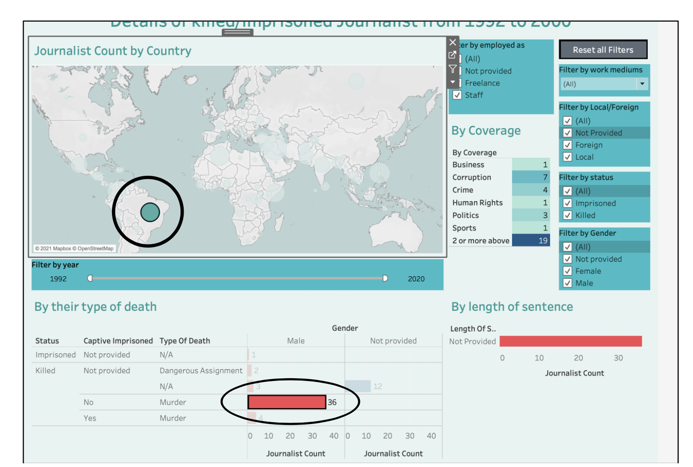
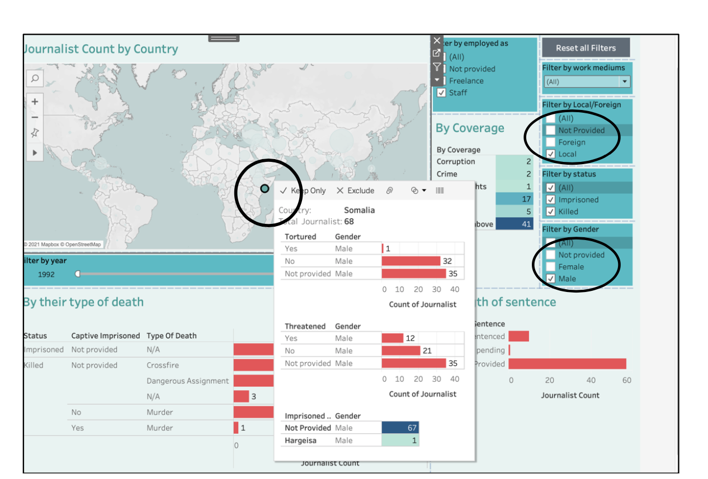
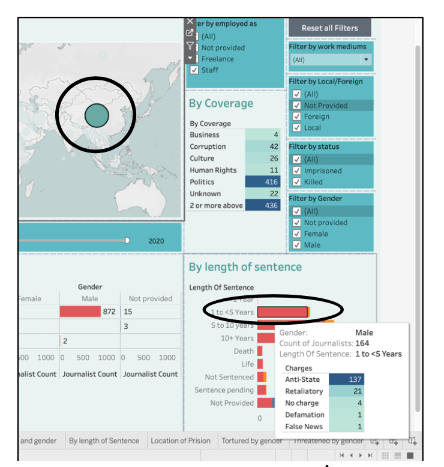

# Interactive Visualization Using Tableau Desktop

 

#### The Dataset:

Committee to protect journalist: journalists killed and imprisoned.
From 1992 to 2020. 

 

#### Questions which can be answered by the implemented project (Interactive visualization - Dashboard):

* How many journalists were being killed/imprisoned by country over years and what coverage they were doing?
* How many journalists were being tortured and threatened and in which all prisons by country by gender?
* Details of sentences assigned to journalists for particular country and what were their charges.
* How many journalists were being killed and what were their type of death and if they are in prisons, how long they have been sentenced?
* Were they local or foreign and what were their work of medium?

 

#### Data wrangling

By glace at dataset, it can be seen that it has many null values, and it has many categories for nominal variables. Few attributes have multiple values with same meaning, for example the length of sentence attributes has 3 different values which means exactly the same, like ‘5-10 years’, ‘5 years to <10 years’ and ‘5-10 Years’, in this case all 3 values had been replayed with single value ‘5 to 10 years’. (Refer to figure 1)

  
   
    <em>Figure 1: the values transformation for length of sentenced attribute</em>

Similar replacement was being done to employed as and other values of length of sentenced, mediums and coverage. Mediums and coverage attributes have many categories. For that calculated field has been create and only top 7-8 categories which has the most count of status(killed/Imprisoned) has been kept as they were, and rest of the categories has marked as others. The attributes which have many nulls like charges and impCountry have been ignored while making the decision of useful attributes because they might give draw the wrong visualization. But in some variable, such null values aren’t null exactly but it’s not applicable such as ‘type of death’ attribute for imprisoned journalist status. In that case the ‘null’ text has been changed to ‘N/A’ and ‘not provided’ for attributes like gender.

 

#### The Dashboard

As displayed the in figure 2, on can selected different filters and the data displayed in the map, 2 graphs and 1 table will change accordingly. The user can also select the any country and it will filter the data for other graphs and table. The user can also filter the data by clicking on any bar of ‘By their type of death’ graph.

  
   
    <em>Figure 2: The Dashboard</em>

As it can be seen in the Figure 3, On hover of any country from the graph, the tooltip will pop up containing the information about the journalist who being tortured and threatened in that selected country. It also contains the list of prisons located in the country with the count of journalist in it. The tooltip data will get filter if user has selected any other filters.

  
   
    <em>Figure 3: On hover over any country</em>

As it can be seen in the Figure 4, On hover over the any bar of ‘By length of sentences’ graph, the tooltip will display with the count of journalist with their charges they have been sentenced for. The data will change according to any selection (filter) chosen by the user.

  
   
    <em>Figure 4: on hover over the bar of ‘By length of sentence’ graph</em>

The project has one addition feature, which makes user to clear out all selection of filter by one click (button click). As displayed in the figure 5, when the button shows the tooltip ‘Reset all filters’ user can click on it and map, 2 graphs and table will be changed to its original state and all filters will be checked again.

  
   
    <em>Figure 5: The rest filter button</em>

User can also make the multiple selection such as clicking on any country (Brazil) and then selecting the bar called ‘Murder’ as type of death and gender male of ‘type of death’, the dashboard data will change accordingly (refer to figure 6). By clicking on any data of ‘coverage’ table and ‘by length of sentence’ graph will not change the data of the dashboard (graph and table does not have any filtration to select).

  
   
    <em>Figure 6: The state of the dashboard after click on any bar of ‘By their type of death’ graph and any country.</em>

 

#### Insights from the visualization

The question like ‘How many journalists were being tortured and threatened and in which all prisons by country by gender’ can be answered. In figure 7, in the Somalia country there are 68 local journalists were being killed or imprisoned, in that 1 male journalist has been tortured and 12 male Journalists have been threatened. A 67 male journalists were being kept at unknow prisons, whereas 1 male journalist has been kept in prison location called ‘Hargeisa’.

  
   
    <em>Figure 7: View of dashboard on multiple filter selection.</em>

Other questions such as what the charges for particular length of sentence in the any country were. As it can see in figure 8, the graph has displayed the 164 male journalists who has been sentenced for 1 to <5 years and their changes were ‘anti- state’ (137 journalists), ‘retaliatory’ (21 journalists), ‘defamation’ (1 journalist), ‘false news’ (1 journalist), and no charges (4 journalists).

  
   
    <em>Figure 8: Details of journalist’s charges of 1 to <5 years of sentence in China</em>

 

#### Critical discussion

As the strength of the Dashboard is that the user can select the multiple filters and get specific details about single country such as their charges and the coverages they were doing, their work mediums, their employment status and many more. Another point which makes it easier to navigate is that ‘reset button’. which will make it dashboard on its original state after user is done with exploring the details of one type of filtration. The provided dataset has many ‘nulls’ and ‘not applicable’ values field, which could have been worked on and displayed in different format. Removing them would not been a great solution, therefor value has been changed to ‘Not provided’ from ‘null’.

 
 
